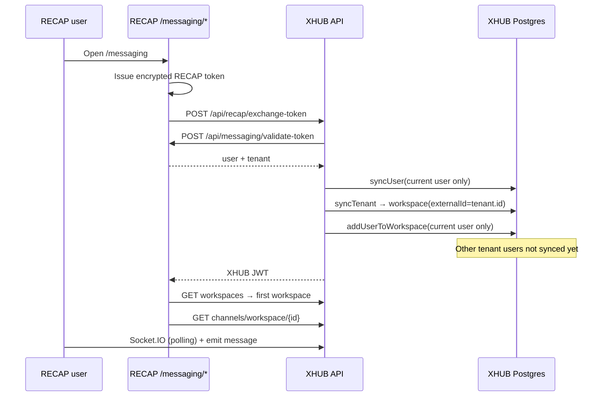

# RECAP ↔ Messaging Platform Integration Plan

**Scope:** How each RECAP tenant’s existing users can message, find, and contact each other — current behavior, gaps, and phased implementation.

**Terminology:** See [messaging-terminology.md](./messaging-terminology.md). UI copy is **per-tenant** (university departments share defaults; CPU NSTP can set institution name and optional overrides). **XHUB** is the internal service codename only.

**Systems:**

| System | Role |
|--------|------|
| **RECAP** | Laravel + Inertia/React — tenants, users, auth, UI at `/messaging` |
| **Messaging platform (XHUB)** | NestJS + PostgreSQL + Socket.IO — workspaces, channels, messages, realtime |

**Last updated:** 2026-06-01

**Implementation status:** All Phase 1, Phase 2, and Phase 3 items implemented (see checklist below).

---

## Executive summary

RECAP ↔ XHUB messaging is a **fully integrated system**: one tenant maps to one workspace with automatic user sync, default channels, roster sync, member directory, direct messages, workspace-scoped search, and webhook support. All Phase 1, Phase 2, and Phase 3 features from the implementation plan have been completed.

---

## How it works today (per tenant)



### Mapping table

| RECAP concept | XHUB concept | When it happens |
|---------------|--------------|-----------------|
| `Tenant` | `Workspace` (`externalId`) | On token exchange, if `user.tenant` is present |
| `User` | `User` (`externalId`) | Only the user opening messaging |
| Tenant membership | `WorkspaceMember` | Only that same user |
| (none) | `Channel` | **Not created** on tenant sync |

### Tenant boundary

- `validateToken` returns `$user->tenant` from RECAP.
- Users **without** `tenant_id` get an XHUB account but **no workspace** — they cannot see tenant channels.
- Each tenant → one workspace via `externalId`. Cross-tenant leakage is unlikely **if** all queries are workspace-scoped (several APIs are not — see gaps).

### Key code paths

| Step | Location |
|------|----------|
| Token issue + exchange proxy | `RECAP/app/Http/Controllers/MessagingController.php` |
| Exchange + sync | `XHUB/apps/backend/src/recap/recap.controller.ts` |
| User/tenant/workspace sync | `XHUB/apps/backend/src/recap/recap-sync.service.ts` |
| Messaging UI | `RECAP/resources/js/components/Messaging/Messaging.jsx` |
| Realtime gateway | `XHUB/apps/backend/src/websocket/gateway.module.ts` |

### Environment alignment

| RECAP | XHUB |
|-------|------|
| `XHUB_API_URL` (server-to-server, e.g. `http://127.0.0.1:3001`) | `RECAP_API_URL` |
| `VITE_XHUB_API_URL` (browser Socket.IO) | `RECAP_API_SECRET`, `RECAP_WEBHOOK_SECRET` |
| `XHUB_API_SECRET` | `FRONTEND_URL`, CORS origins |

**Tunnel:** Production `cloudflared` uses `C:\Users\Administrator\.cloudflared\config.yml` — keep `xhub.cpu-crums.com` ingress in sync with `RECAP/cloudflared.yml`.

---

## How tenant users are supposed to find & contact each other

| Need | Intended model | Current reality |
|------|----------------|-----------------|
| See who is in my org | Workspace member list | API returns members on `GET /api/workspaces/:id`, but **no RECAP proxy or UI** |
| Start a group conversation | `#general` or team channels | **`syncTenant` does not create channels** (unlike manual `workspaces.create()` which creates `general`) |
| Message a specific person | `DIRECT` channel | Schema supports it; **no API/UI to open or find DMs** |
| Know who is online | Socket `user_online` / `user_offline` | Emitted, but **UI does not show a member list or presence** |
| Find someone by name | Search | XHUB `GET /api/search/users` is **global**, not workspace-scoped; **not exposed in RECAP** |
| New hire appears in chat | Webhook / bulk sync | XHUB has `POST /api/recap/webhook` handlers; **RECAP never dispatches events**; `user.created` wouldn’t add workspace membership anyway |

**Practical outcome:** Two users in the same RECAP tenant can only talk if:

1. Both have opened `/messaging` at least once,
2. Someone created a channel, and
3. They both know which channel to use.

There is no “people” sidebar and no DM button.

---

## Gap analysis

### P0 — Blocks “existing users can message each other”

| # | Gap | Evidence |
|---|-----|----------|
| 1 | **No default channel** when tenant workspace is created | `recap-sync.service.ts` `syncTenant` creates workspace only; `workspaces.service.create()` is the only place that auto-creates `general` |
| 2 | **Lazy single-user sync** | `exchange-token` syncs only `validation.user.id`; other `User::where('tenant_id', …)` in RECAP are invisible in XHUB until they visit messaging |
| 3 | **Empty channel list UX** | `fetchXhubChannels` returns `[]` → UI shows no way to chat |
| 4 | **No member directory / “new message”** in `Messaging.jsx` | UI = channel list + transcript only |
| 5 | **No REST send fallback** | Send only via `socket.emit('message')`; no `POST /messaging/.../messages` proxy if socket down |
| 6 | **RECAP → XHUB webhooks not implemented** | `MessagingController::registerWebhook` is a stub; no `UserObserver` / job posting to `POST /api/recap/webhook` |
| 7 | **`user.created` webhook doesn’t join workspace** | `handleUserCreated` only `syncUser`; no `addUserToWorkspace` + tenant id in payload |

### P1 — Expected for “contact each other” in a school/org product

| # | Gap |
|---|-----|
| 8 | **Direct messages** — no `findOrCreateDirectChannel(userA, userB)` |
| 9 | **Workspace-scoped user search** — `users.service.search` has no `workspaceId` filter |
| 10 | **List members endpoint** — `GET /api/workspaces/:id/members` missing (only embedded in full workspace GET) |
| 11 | **Tenant roster API for XHUB** — e.g. `GET /api/messaging/tenants/{id}/users` for bulk sync |
| 12 | **Department / role channels** — RECAP has `department_id`, roles; unused for messaging |
| 13 | **Navigation** — `/messaging` exists but no obvious link in RECAP layout |
| 14 | **Inactive users** — `is_active` on RECAP user not checked on validate/sync |
| 15 | **Avatar sync** — RECAP uses `avatar_path`; validate returns `avatar_url` (may be null) |

### P2 — Platform completeness (XHUB has schema/API; RECAP UI doesn’t)

| Feature | Backend | UI / integration |
|---------|---------|------------------|
| Threads | `Thread` model | None |
| Reactions | `MessagesController` reactions | None |
| Attachments | `MessageAttachment` | None |
| Pin / edit / delete message | API exists | None |
| Typing indicators | Gateway events | None |
| Read receipts | `message_read` emit | None |
| In-app notifications | XHUB `Notification` model | RECAP uses separate `PlatformNotification` / SSE — **not bridged** |
| Meilisearch | `SearchService` | Requires Meilisearch env; not wired from RECAP |
| Private channels | `ChannelType.PRIVATE` | No membership table; `findByWorkspace` returns all channels |
| Refresh token | Issued on exchange | UI never refreshes JWT before socket/API expiry |

### P3 — Security & ops

| Issue | Detail |
|-------|--------|
| Global user search | Could expose users outside tenant if UI added without scoping |
| Channel access | Membership = workspace-level only; no per-channel ACL for `PRIVATE` |
| Superadmin | RECAP superadmins may have no `tenant_id` — messaging breaks for them |
| Bulk re-sync | No artisan command to “sync all tenant users to XHUB” for go-live |

---

## Recommended implementation plan

### Phase 1 — Minimum viable tenant chat (1–2 days)

**Goal:** Any two active users in the same RECAP tenant can open messaging and talk without manual setup.

1. **On `syncTenant`**, after workspace create/update:
   - Ensure default channels: `general` (PUBLIC), optionally `announcements` (read-only later).
   - Idempotent (`findFirst` by name).

2. **Bulk sync on exchange** (or dedicated job):
   - **RECAP:** `GET /api/messaging/tenants/{id}/users` (paginated, `X-API-Secret`) listing active users for tenant.
   - **XHUB:** in `exchange-token` (or async job), for each RECAP user: `syncUser` + `addUserToWorkspace`.
   - Cap batch size; run full sync once per tenant per day or on admin “Sync messaging”.

3. **RECAP proxies + UI**
   - `GET /messaging/members` → XHUB workspace members (resolve workspace by tenant `externalId`).
   - `POST /messaging/messages` → `POST /api/messages` fallback.
   - UI: left sidebar = **People** (online dot) + **Channels**; pick channel or start DM placeholder.

4. **Fix avatars** in `validateToken` / `getUser`: map `avatar_path` to public URL.

**Deliverables:**

- [x] `RecapSyncService.ensureDefaultChannels(workspaceId)`
- [x] `RecapSyncService.syncTenantMembers(recapTenantId)`
- [x] RECAP `MessagingController::listTenantUsers` + route
- [x] RECAP `listMembers`, `sendMessage` routes
- [x] `Messaging.jsx` members panel + REST send fallback

---

### Phase 2 — Find & direct contact (2–4 days)

**Goal:** Users can search colleagues and open a 1:1 conversation.

1. **DM API (XHUB):** `POST /api/channels/direct` with `{ workspaceId, participantUserId }` → find/create `DIRECT` channel (deterministic key, e.g. sorted user IDs).

2. **Workspace member search:** `GET /api/workspaces/:id/members?q=` or scope existing search by `workspaceId`.

3. **RECAP UI:** search box “Find a colleague”, click → open DM channel, load messages.

4. **Webhooks (RECAP → XHUB):**
   - On `User` created/updated/deleted, `Tenant` created/updated: HTTP to XHUB with signed payload.
   - Extend handlers: `user.created` → `syncUser` + `addUserToWorkspace(tenant_id)`; `user.deleted` → deactivate + remove member.

**Deliverables:**

- [x] `ChannelsService.findOrCreateDirectChannel`
- [x] RECAP `UserObserver` + `XhubWebhookService`
- [x] Signed webhook payload + `XHUB_WEBHOOK_SECRET` verification
- [x] DM flow in `Messaging.jsx`

---

### Phase 3 — Org-shaped messaging (~1 week)

**Goal:** Messaging fits RECAP’s org structure (departments, roles).

1. Optional auto-channels: `#department-{id}`, role-based (instructors, students) — driven by RECAP config on `Tenant`.

2. Bridge **notifications:** XHUB mention / DM → RECAP `PlatformNotification` or existing SSE.

3. Private channels + channel membership table if needed.

4. Admin: RECAP settings “Enable messaging”, dashboard nav link, “Sync all users” button.

**Deliverables:**

- [x] Tenant setting `messaging_enabled`
- [x] Nav link to `/messaging`
- [x] Notification bridge service (`messaging_notifications` + XHUB → RECAP notify)
- [x] Optional department channel provisioning
- [x] Subject group channels (`sg-{id}`) + `channel_members` scoped access
- [x] RECAP APIs: `tenants/{id}/subject-groups`, `subject-groups/{id}/members`
- [x] Webhooks: `subject_group.created|updated|deleted`
- [x] RECAP `php artisan messaging:sync-subject-groups` backfill

---

### Phase 4 — Polish (ongoing)

- [ ] Threads, attachments, reactions, read receipts (API exists; UI pending)
- [ ] Meilisearch message search (workspace-scoped)
- [x] JWT refresh in `Messaging.jsx`
- [x] Mobile-friendly layout (sidebar / chat toggle)
- [x] Socket transport tuning for Cloudflare tunnel (`polling` + `upgrade: false`)
- [x] Typing indicators + unread badges
- [x] Tenant-themed UI via CSS variables (`TenantThemeService`, `messaging.css`)

---

## Verification checklist (per tenant)

| Test | Pass criteria |
|------|----------------|
| Tenant A has 5 users, only 1 visited messaging | After Phase 1 bulk sync, all 5 appear in member list |
| User B never opened `/messaging` | User A still sees B; A can post in `#general`; B sees history after first login |
| Two users, same tenant | Can open DM and exchange messages in real time |
| User in Tenant A | Cannot search or DM users in Tenant B |
| Deactivate user in RECAP | Cannot exchange token / removed from workspace |
| New user invited in RECAP | Appears in chat within webhook latency (or after sync job) |

**Existing script:** `RECAP/scripts/test-messaging-integration.php` — extend with multi-user, channel, and member assertions.

**Manual smoke test:**

```text
1. Log in as User A (tenant T) → /messaging → Connected, #general visible
2. Log in as User B (same tenant) → sees same channel and A’s messages
3. User A searches B → opens DM → both receive realtime messages
4. Log in as User C (different tenant) → cannot see T’s members or channels
```

---

## Quick reference: what exists vs what’s missing

| Layer | Exists | Missing for tenant contact |
|-------|--------|----------------------------|
| RECAP API | `validate-token`, `users/{id}`, `tenants/{id}`, `tenants/{id}/users`, `tenants/{id}/subject-groups`, webhooks | — |
| RECAP web | `/messaging`, token/channels/messages/members proxies, DM, sync roster | threads UI, attachments |
| XHUB sync | user/tenant/member, default + dept + **sg-*** channels, channel members | — |
| XHUB API | workspaces, scoped channel list, DM, messages, member search | threads UI |
| XHUB realtime | connect, `message` handler, typing, presence events | UI for people/presence |
| RECAP `UserController` | Full tenant user CRUD | No hook to XHUB |

---

## Suggested priority order

1. Default `#general` + bulk tenant user sync (unblocks all existing users).
2. Member list + REST send in RECAP UI.
3. DM + workspace-scoped search.
4. RECAP webhooks for ongoing parity.
5. Notifications, departments, advanced channel types.

---

## Related files

### RECAP

- `app/Http/Controllers/MessagingController.php`
- `app/Services/MessagingTokenService.php`
- `routes/web.php` — `/messaging/*`
- `routes/api.php` — `/api/messaging/*`
- `resources/js/components/Messaging/Messaging.jsx`
- `config/services.php` — `messaging.*`
- `scripts/test-messaging-integration.php`

### XHUB

- `apps/backend/src/recap/recap.controller.ts`
- `apps/backend/src/recap/recap-sync.service.ts`
- `apps/backend/src/recap/recap.service.ts`
- `apps/backend/src/websocket/gateway.module.ts`
- `apps/backend/src/workspaces/workspaces.service.ts`
- `apps/backend/src/channels/channels.service.ts`
- `apps/backend/prisma/schema.prisma`

### Ops

- `C:\Users\Administrator\.cloudflared\config.yml` — live tunnel (include `xhub.cpu-crums.com` → `127.0.0.1:3001`)
- `RECAP/cloudflared.yml` — reference copy; keep in sync
- `XHUB/ecosystem.config.js` — PM2 `xhub-api`

---

## Appendix: RECAP role → XHUB workspace role

Defined in `RecapSyncService.mapRecapRoleToXHUBRole`:

| RECAP role | XHUB `WorkspaceRole` |
|------------|----------------------|
| `admin` | `ADMIN` |
| `staff` | `MODERATOR` |
| `instructor` | `MODERATOR` |
| `student` | `MEMBER` |
| (other / missing) | `MEMBER` |
